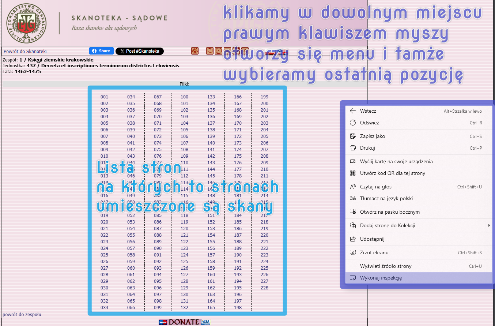
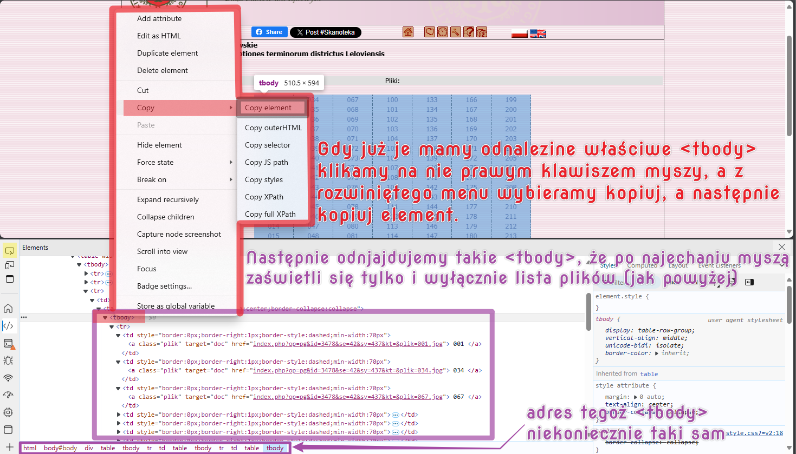
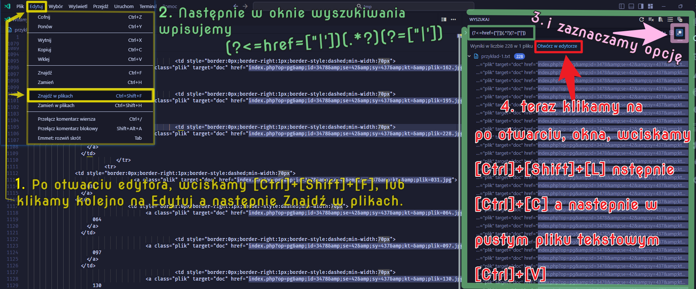
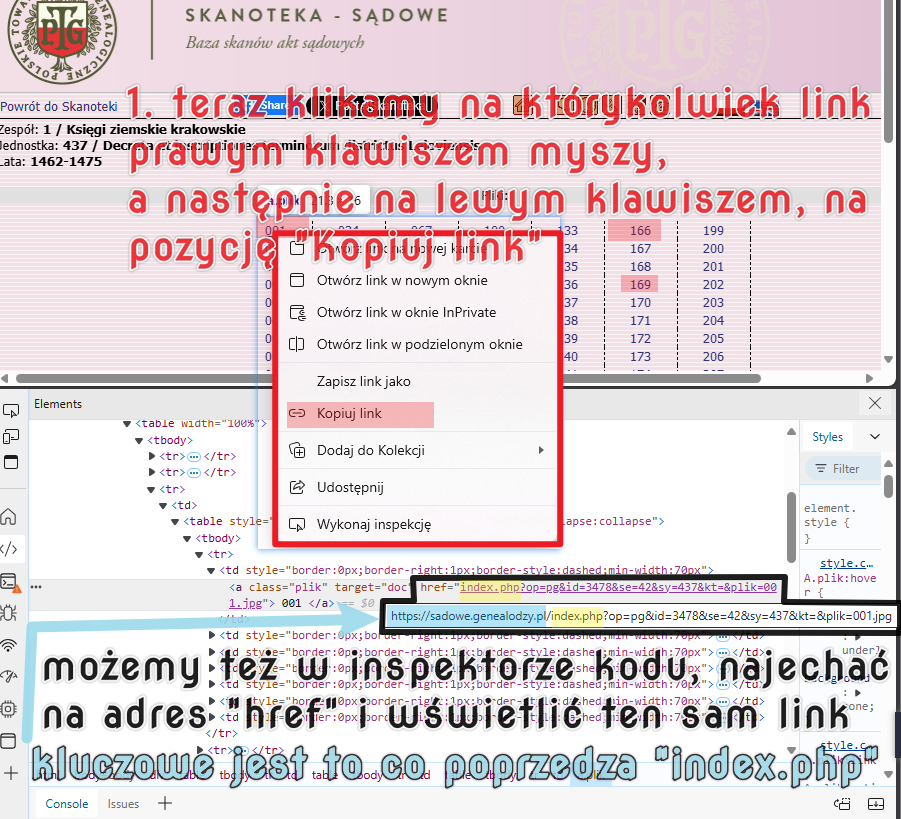
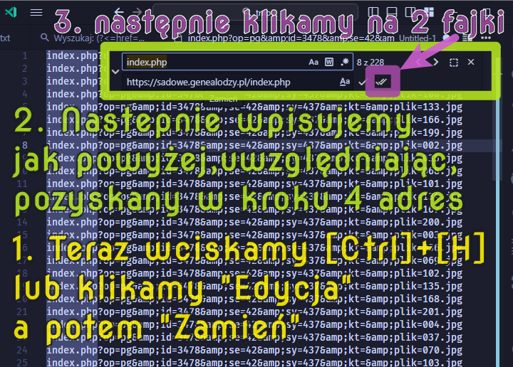
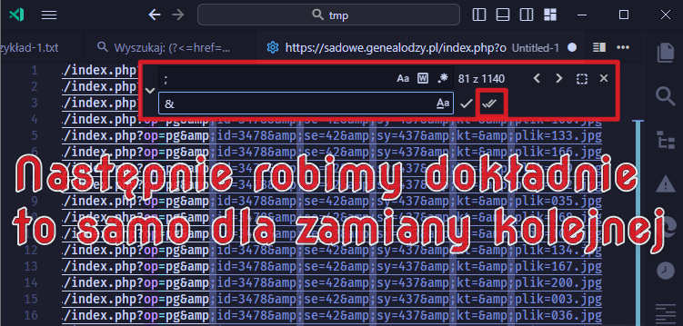
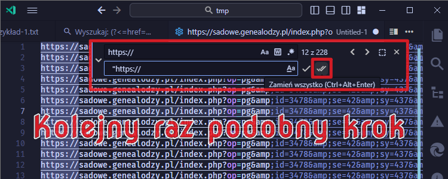
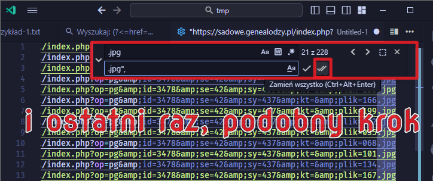
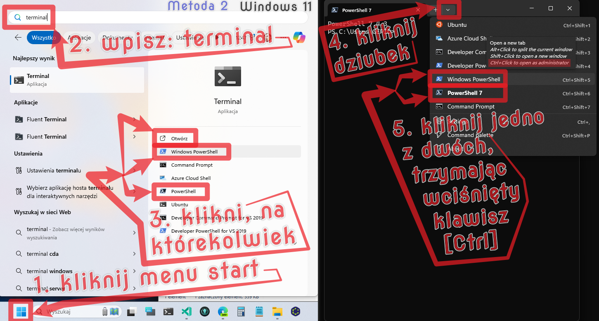

# skrobaczSkanoteki - wersja powłokowa

**Ta wersja programu charakteryzuje się minimalistyczną funkcjonalnością dzięki temu jest lżejsza. (już działa).**

Dodatkowo równolegle do tej wersji występuje wersja graficzna - która charakteryzuje się rożnymi udogodnieniami, dlatego jej objętość jest większa. (w fazie rozwoju); Rozwijana jest w gałęzi [**main-large** (https://github.com/j-Cis/skorobaczSkanoteki/tree/main-large)](https://github.com/j-Cis/skorobaczSkanoteki/tree/main-large) .

─-

## 1. Pobieranie programu skrobaczSkanoteki w wersji powłokowej

.webp)

**W celu użycia programu, udajemy się na [stronę pobierania programu (https://github.com/j-Cis/skorobaczSkanoteki/releases)](https://github.com/j-Cis/skorobaczSkanoteki/releases) należy zwrócić szczególną uwagę czy w nawiasie przy danej wersji jest dopisek `(powłokowy)` czy `(graficzny)` są to 2 różne gałęzie programu, z nieco inną koncepcją.**

## 2. Przygotowanie nowego zadania dla skrobaczSkanoteki w wersji powłokowej

- w folderze **`tasks`** utwórz plik tekstowy na wzór pliku **`test.txt`**
- ważne nie usuwaj pliku **`test.txt`**
- pamiętaj że każdy link do strony musi być w podwójnym cudzysłowie,
- pamiętaj że każdy link musi być poprzedzony wcięciem, a na końcu wersu musi znajdować się przecinek
- pamiętaj że w 1 lini musi być

```toml
  STRONY = [
```

- pamietaj że w następującej linijce po ostatnim linku, musi być

```toml
  ]

  [METRYCZKA]
  ZESPOL_SYGNATURA    = "44444"
  JEDNOSTKA_SYGNATURA = "1331"
```

- pamiętaj że w metryczce obowiązkowymi polami są pola sygnaturalne! (zamieszczone powyżej)
- Możesz dodawać dowolne inne pola do metryczki
  - pamiętając by w nazwie pola nie było
    - spacji
    - znaków specjalnych za wyjątkiem znaku podkreślenia
    - innych znaków niż znaki z alfabetu angielskiego i cyfr
  - pamietaj że wielkość znaków ma znaczenie
  - pamiętaj że tylko i wyłącznie liczby mogą być nie być w cudzysłowie
- Pamiętaj że ostatnia linia dokumentu musi być pusta

Przykładowy plik zadania

```toml
STRONY = [
  "https://sadowe.genealodzy.pl/index.php?op=pg&amp&id=2456&amp&se=5&amp&sy=18&amp&kt=&amp&plik=087.jpg",
  "https://sadowe.genealodzy.pl/index.php?op=pg&amp&id=2456&amp&se=5&amp&sy=18&amp&kt=&amp&plik=088.jpg",
  "https://sadowe.genealodzy.pl/index.php?op=pg&amp&id=2456&amp&se=5&amp&sy=18&amp&kt=&amp&plik=089.jpg",
  "https://sadowe.genealodzy.pl/index.php?op=pg&amp&id=2456&amp&se=5&amp&sy=18&amp&kt=&amp&plik=090.jpg",
  "https://sadowe.genealodzy.pl/index.php?op=pg&amp&id=2456&amp&se=5&amp&sy=18&amp&kt=&amp&plik=091.jpg",
]

[METRYCZKA]
ZESPOL_SYGNATURA = "44444"
JEDNOSTKA_SYGNATURA = "1331"
ZESPOL_OPIS = "Sądy różne - zbiór szczątków zespołów"
SERIA_OPIS = "Forum Nobilium"
JEDNOSTKA_OPIS = "Acta successionalia et pupillaria"
JEDNOSTKA_LATA_OD = 1739
JEDNOSTKA_LATA_DO = 1804

```

## 3. Pozyskiwanie listy stron do utworzenia zadania opisanego w punkcie 2

### Krok 1



─-

### Krok 2



**Teraz otwieramy edytor tekstu, może być systemowy notatnik, a najlepiej jakby był to vsCODE. Następnie w nowym pliku tekstowym, wklejamy, uprzednio skopiowaną zawartość naszego `<tbody>` i dla bezpieczeństwa zapisujemy plik.**

─-

### Krok 3

**Teraz najlepiej było by już posiadać vsCODE, lub inny zaawansowany edytor tekstu. oczywiscie można to zrobić bez jego pomocy - ręcznie, ale automatyzacja procesu była by sprawniejsza. Poniżej pokażę jak zrobić to w vsCODE. Te zaawansowane edytory tekstu (np. znam jeszcze Atom, Notepad++), działają dość podobnie, ale maja też różnice.**

**INSTALACJA (OPCJONALNA) PROGRAMU vsCODE,ZOSTAŁA OPISANA W PUNKCIE: "`DODATEK C`, PONIŻEJ"**



**Tekst który należy wpisać do okna wyszukiwania, można wygodnie skopiować sobie z tego miejsca `(?<=href=["|'])(.*?)(?=["|'])`  a następnie w oknie wyszukiwania wkleić. NALEŻY PAMIĘTAĆ O ZAZNACZENIU OPCJI "RegEx" KTÓRĄ NA GRAFICE POWYZEJ OZNACZYŁEM NA RÓŻOWO Z NUMEREM 3.**

─-

### Krok 4



─-

### Krok 5



**W okienku znajdź wpisujemy  `index.php`  natomiast w oknie zamień w tym przypadku  `https://sadowe.genealodzy.pl/index.php`  to co tu wpisujemy zależy od tego co uzyskamy w 4 kroku.**

─-

### Krok 6



**W okienku znajdź wpisujemy średnik  `;`  natomiast w oknie zamień wpisujemy  `&`  znak end.**

─-

### Krok 7



**W okienku znajdź wpisujemy średnik  `http`  natomiast w oknie zamień wpisujemy `|  "http` (bez znaku `|` został on użyty tylko po to bo zwrócić uwage na odstęp - 2 spacje) należy zwrócić uwagę na to że znak cudzysłowu poprzedzają 2 spacje, jest to bardzo istotne.**

─-

### Krok 8



**W okienku znajdź wpisujemy średnik  `.jpg`  natomiast w oknie zamień  `.jpg",`  wpisujemy.**

> **Tak przygotowaną listę wklejamy do pliku z zadaniem opisanym w drugim (2.) punkcie.**
>
> ```toml
> STRONY = [
>   "https://sadowe.genealodzy.pl/index.php?op=pg&amp&id=2456&amp&se=5&amp&sy=18&amp&kt=&amp&plik=087.jpg",
>   "https://sadowe.genealodzy.pl/index.php?op=pg&amp&id=2456&amp&se=5&amp&sy=18&amp&kt=&amp&plik=088.jpg",
>   "https://sadowe.genealodzy.pl/index.php?op=pg&amp&id=2456&amp&se=5&amp&sy=18&amp&kt=&amp&plik=089.jpg",
>   "https://sadowe.genealodzy.pl/index.php?op=pg&amp&id=2456&amp&se=5&amp&sy=18&amp&kt=&amp&plik=090.jpg",
>   "https://sadowe.genealodzy.pl/index.php?op=pg&amp&id=2456&amp&se=5&amp&sy=18&amp&kt=&amp&plik=091.jpg",
> ]
>
> [METRYCZKA]
> ZESPOL_SYGNATURA = "44444"
> JEDNOSTKA_SYGNATURA = "1331"
> ZESPOL_OPIS = "Sądy różne - zbiór szczątków zespołów"
> SERIA_OPIS = "Forum Nobilium"
> JEDNOSTKA_OPIS = "Acta successionalia et pupillaria"
> JEDNOSTKA_LATA_OD = 1739
> JEDNOSTKA_LATA_DO = 1804
>
> ```

─-

## 4. Ustawienia programu skrobaczSkanoteki (powłokowy)

Domyślnie aby nie przeciążyć serwera ustawione jest tylko 6 operacji na minute.
Można to zmienić w pliku `ustawienia.ts`

```typescript
const OPERACJE_NA_MINUTE:number = 6;
```

─-

## 5. Uruchamianie programu skrobaczSkanoteki (powłokowy)

**Program skrobaczSkanoteki (powłokowy), można uruchomić tylko gdy, posiadasz zainstalowane środowisko wykonawcze DeNo, jeśli go nie posiadasz, niezbędne będzie udanie się do kolejnego punktu o `DODATEK B` - gdzie znajduje się instrukcja pozyskania tegoż środowiska wykonawczego DeNo - jego działanie polega na wykonywaniu napisanego kodu programu.**

Istnieją dwie metody uruchomienia programu, **'A'** i **'B'** w gruncie rzeczy metoda **'A'**  sprowadza się do automatycznego wykonania tego co jest w **'B'** metodzie.

### A. Uruchomienie poprzez dwukrotne kliknięcie **`start.bat`** lub **`start.cmd`** (jest to skrótowa metoda)

- przed uruchomieniem ważne jest by zastąpić w pliku `start.cmd` lub `start.bat` wyraz `test` nazwę utworzonego zadania a następnie zapisać zmiany i uruchomić jeden z tych plików, oba robią dokładnie to samo co punkt `B.` ważne by i tu nie zamykać okna do ukończenia, co może być czasochłonne

### B. Uruchomienie poprzez wpisanie komendy **`deno task start ─zadanie=test`** do programu powłokowego zwanego też konsolą czy terminalem, lub PowerShell czy Bash; i naciśnięcie enter. (jest to najszybsza opcja, bez vsCODE)

```powershell
deno task start ─zadanie=test
```

- gdzie zamiast `test` należy wpisać nazwę utworzonego zadania a następnie kliknąć enter i nie zamykać okna do ukończenia, co może być czasochłonne

─-

Jeśli nie korzystałeś / korzystałaś nigdy z  powłoki systemowej (zwanej też konsolą, terminalem czy PowerShell lub Bash),opiszę pokrótce to w punkcie **"`DODATEK A`"**.

**Praca programu na grafice poniżej**

.webp)

**Rezultaty pracy programu na grafice poniżej**

.webp)

─-
─-

## DODATEK A: Używanie powłoki systemowej

Każdy system operacyjny posiada wbudowaną powłokę systemową. Oprócz tego istnieją dodatkowe które usprawniają pewne procesy, trzeba jednak je sobie samodzielnie pobrać. Zacznę wyjaśnienie od tych wbudowanych.

### SYSTEM WINDOWS

Poniższe grafiki ukazują jak uruchomić z uprawnieniem administratorskim, do zwykłej pracy programu nie jest to potrzebne, jednak będzie to potrzebne do zainstalowania środowiska wykonawczego DeNo (jeśli go nie posiadasz - opis zdobycia go w "**`DODATKU B`**" ).

─-

**Metoda 1**


─-

**Metoda 2**



─-

**Metoda 3 i 4**


─-

### SYSTEM MACOS

... (niebawem dodam info)

─-

### SYSTEM LINUX

... (niebawem dodam info)

─-
─-

**Po uruchomieniu takiej powłoki, zwyczajnie wpisujemy komendy, lub wklejamy-skopiowane i zatwierdzamy je klawiszem `[ENTER]`.**

### WIELO-PLATFORMOWA POWŁOKA **PowerShell 7**

Jeżeli posiada się starszy system Windows, lub jakikolwiek inny system operacyjny, wygodne może okazać się zainstalowanie **PowerShell 7**

Trzeba wejść na [stronę pobierania **PowerShell 7** (https://github.com/PowerShell/powershell/releases)](https://github.com/PowerShell/powershell/releases) Następnie wybrać wersję dla naszego sytemu.


Po instalacji może okazać się że będzie potrzeba uruchomienia ponownie komputera, w Windows 10 i 11, nie jest to wymagane.

> [**Oficjalna strona PowerShell 7** (https://microsoft.com/PowerShell)](https://microsoft.com/PowerShell)

─-
─-

## DODATEK B: Instalacja Środowiska Wykonawczego DeNo

DeNo to niezbędne [**środowisko uruchomieniowe** (wiki-en)](https://en.wikipedia.org/wiki/Runtime_system) dla programu **skanoteka-pobieracz** można je zainstalować: na **Windows**, na MacOS, na Linux.

- [**Oficjalna strona DeNo** (https://deno.com/)](https://deno.com/) na której można zapoznać się z szczegółami.
- [**Oficjalna strona repozytorium DeNo** (https://github.com/denoland/deno)](https://github.com/denoland/deno) na której można zapoznać się z kodem źródłowym programu **DeNo** .

DeNo ([/ˈdiːnoʊ/](http://ipa-reader.xyz/?text=%CB%88di%CB%90no%CA%8A), wymowa
`dii-no`) to [**środowisko uruchomieniowe** (wiki-en)](https://en.wikipedia.org/wiki/Runtime_system) dla [**JavaScript** (wiki-en)](https://en.wikipedia.org/wiki/JavaScript), [**TypeScript** (wiki-en)](https://en.wikipedia.org/wiki/TypeScript) i [**WebAssembly** (wiki-en)](https://en.wikipedia.org/wiki/WebAssembly), które jest oparte na [**silniku JavaScript V8** (wiki-en)](https://en.wikipedia.org/wiki/V8_(JavaScript_engine)) i języku programowania [**Rust** (wiki-en)](https://en.wikipedia.org/wiki/Rust_(programming_language)) oraz [**Tokio** (wiki-en)](https://en.wikipedia.org/wiki/Tokio_(software)). [**DeNo** (wiki-en)](https://en.wikipedia.org/wiki/Deno_(software)) współtworzył [**Ryana Dahla** (wiki-en)](https://en.wikipedia.org/wiki/Ryan_Dahl), który stworzył również Node.js.

### **1.0.** Instalacja DeNo na Windows

Na Windows można zainstalować Deno na 2 sposoby: albo przez wbudowany w każdy system (**Terminal** / **Konsole**) **PowerShell**, *albo za pomocą menadżera pakietów [Chocolatey](https://chocolatey.org/packages/deno) - który nie jest wbudowany w system (wymaga dodatkowej instalacji)*

#### **B-1.1.** PowerShell (Windows)

W pierwszej kolejności należy otworzyć (**terminal** / **konsole**) **PowerShell** na swoim komputerze **(OPISAŁEM TO W POPRZEDNIM PUNKCIE : DODATEK-A)**, a następnie wkleić lub wpisać poniższą linijkę kodu i nacisnąć enter.

```powershell
irm https://deno.land/install.ps1 | iex

```

─-

#### **B-1.2.** Alternatywną metodą jest użycie menazera pakietów [Chocolatey](https://chocolatey.org/packages/deno) (Windows)

```powershell
choco install deno
```

### **B-2.0.** Instalacja DeNo na macOS

#### **B-2.1.** Shell (Mac)

```sh
curl -fsSL https://deno.land/install.sh | sh
```

#### **B-2.2.** Menadżer pakietów [Homebrew](https://formulae.brew.sh/formula/deno) (Mac)

```sh
brew install deno
```

### **B-3.0.** Instalacja DeNo na Linux

#### **B-3.1.** Shell / Bash (Linux)

```sh
curl -fsSL https://deno.land/install.sh | sh
```

─-
─-

## DODATEK C: Instalacja Zaawansowanego Edytora Tekstu vsCODE

- Opis [programu **vsCODE (Visual Studio Code)** możemy uzyskać na wikipedii (https://pl.wikipedia.org/wiki/Visual_Studio_Code)](https://pl.wikipedia.org/wiki/Visual_Studio_Code)

- [Oficjalna strona programu **vsCODE (Visual Studio Code)** (https://code.visualstudio.com/) na niej też możemy ściągnąć wersje na nasz system Windows/macOS/Linux i inne](https://code.visualstudio.com/)

- [Jest też wersja online aczkolwiek nie wiem czy posiada pełną funkcjonalność. (https://vscode.dev/)](https://vscode.dev/)

─-
─-

## DODATEK D: Działanie programu

Program działa na zasadzie asynchronicznej pętli sterowanej plikiem z zadaniem w folderze `tasks`. Dla każdego wylistowanego linku w sekcji `STRONY` wykonywany jest ciąg operacji. Przerwanie pracy programu skutkować będzie częściowym pobraniem materiałów umieszczonych w zadaniu, choć to czasochłonne można przejrzeć ten zestaw, i przed kolejnym uruchomieniem usunąć już istniejące pozycje.

### `STRUKTURA PROGRAMU`

> ```tree
>   ├─. pobieracz-skanoteki.ts  - - - - - - - - # plik z głównym skryptem programu popierającym i wywołującym poniższe skrypty;
>   ├─. skrobacz-skanoteki.ts - - - - - - - - - # plik z skryptem wyłuskujacym z stron skanoteki link do pliku z skanem;
>   ├─. pobieracz.ts  - - - - - - - - - - - - - # plik z skryptem ściągającym skany z serwera skanoteki, i zapisującym je na dysku;
>   ├─. spowalniacz.ts  - - - - - - - - - - - - # plik z skryptem zabezpieczającym serwer skanoteki;
>   ├─. ustawienia.ts - - - - - - - - - - - - - # plik z ustawieniami programu;
>   ├─. deno.json . . . . . . . . . . . . . . . # plik określający zależności bibliotek użytych w programie, oraz określający projekt;
>   ├─. deno.lock . . . . . . . . . . . . . . . # plik automatycznie generujacy się podczas pracy programu;
>   ├─. start.bat . . . . . . . . . . . . . . . #plik opisane w sekcji 5.A.
>   ├─. start.cmd . . . . . . . . . . . . . . . # plik opisane w sekcji 5.A.
>   ├─. TODO.md . . . . . . . . . . . . . . . . # plik z pomysłami do uwzględnienia w kolejnej wersji;
>   ├─. README.md . . . . . . . . . . . . . . . # plik z tą dokumentacją;
>   ├─. [docs]  . . . . . . . . . . . . . . . . # folder z plikami graficznymi z tej dokumentacji;
>   ├─. [tasks] . . . . . . . . . . . . . . . . # folder z zadaniami, do wykonania w programie;
>   ├─. [download]  . . . . . . . . . . . . . . # folder w którym będą zapisywane pobierane skany;
>   ├─. [.vscode] . . . . . . . . . . . . . . . # folder z ustawieniami programu vsCODE;
>   └─. .gitignore  . . . . . . . . . . . . . . # plik mówiący czego mielibyśmy nie wysyłać na serwer, gdyby chcielibyśmy nanieść na program poprawkę;
> ```

Kolejność prezentowanych skryptów odpowiada kolejności na powyższym drzewie, przy czym zaprezentowane będą tylko te po których następują myślniki, czyli pierwsze 5 plików z rozszerzeniem **`.ts`** (**TypeScript**).

### (1) `pobieracz-skanoteki.ts` (plik z głównym skryptem programu popierającym i wywołującym poniższe skrypty)

> ```typescript
> import { parseArgs } from "jsr:@std/cli";
> import { ensureDirSync, ensureFileSync } from "jsr:@std/fs";
> import { parse } from "jsr:@std/toml";
> import { pobieracz, type PLIK_POBIERZ_JAKO } from "./pobieracz.ts";
> import spowalniacz from "./spowalniacz.ts";
> import skrobaczSKANOTEKI from "./skrobacz-skanoteki.ts";
> import { OPERACJE_NA_MINUTE } from './ustawienia.ts';
> 
> const zadania = "./tasks";
> const zadanieURL = `${zadania}/${parseArgs(Deno.args).zadanie ?? "test"}.txt`;
> ensureDirSync(zadania);
> ensureFileSync(zadanieURL);
> 
> interface ZADANIE_METRYCZKA {
>   ZESPOL_SYGNATURA: string | number;
>   ZESPOL_OPIS?: string;
>   SERIA_NAZWA?: string;
>   JEDNOSTKA_SYGNATURA: string | number;
>   JEDNOSTKA_OPIS?: string;
>   JEDNOSTKA_LATA_OD?: number;
>   JEDNOSTKA_LATA_DO?: number;
> }
> 
> interface ZADANIE {
>   STRONY: string[];
>   METRYCZKA: ZADANIE_METRYCZKA;
> }
> 
> const zadanie:ZADANIE = parse(Deno.readTextFileSync(zadanieURL));
> pobieraczSKANOTEKI(zadanie);
> 
> 
> /**
>  * Pobieranie obrazków z Skanoteki 
>  *
>  * @param zlecenie 
>  * @returns
>  */
> async function pobieraczSKANOTEKI(zlecenie: ZADANIE):Promise<void> {  
>   for (let i = 0; i < zlecenie.STRONY.length; i++) {
>     const stronaURL: string = zlecenie.STRONY[i];
>     const nazwaPliku: string = stronaURL.substring(stronaURL.match(/(?!.*=)(.*)/i)?.index ?? 0);
>     const pobranaStrona = await fetch(stronaURL).then((res) => res.text());
>     await spowalniacz(OPERACJE_NA_MINUTE);
>     const pobierzObrazZ = await skrobaczSKANOTEKI(pobranaStrona);
>     //pobieranie obrazka         
>     try {
>       //const nazwaPlikuTab = nazwaPliku.split("_").map(a => a.split("-")[1]);
>       const zapiszPlikJako: PLIK_POBIERZ_JAKO = {
>         zapiszJako: nazwaPliku,
>         zapiszDo: `./download/ZESPOL_${zlecenie.METRYCZKA.ZESPOL_SYGNATURA}/JEDNOSTKA_${zlecenie.METRYCZKA.JEDNOSTKA_SYGNATURA}`,
>         metryczka: [
>           ...[...Object.entries(zlecenie.METRYCZKA)].map(([key, val]) => ({[key]: val})),
>           {LINK_DO_OBRAZU      : pobierzObrazZ },
>           {LINK_DO_STRONY      : stronaURL },
>         ]
>       };
>       const pobranyPlik = await pobieracz(pobierzObrazZ, zapiszPlikJako);
>       console.log(pobranyPlik);
>     } catch (err) {
>         console.log(err);
>     }
>   }  
> }
> ```

### (2) `skrobacz-skanoteki.ts` (plik z skryptem wyłuskujacym z stron skanoteki link do pliku z skanem)

> ```typescript
> import { DOMParser } from "jsr:@b-fuze/deno-dom";
> 
> /**
>  * Skrobanie adresu zasadniczego z którego można pobrać plik obrazka
>  *
>  * @param pobranaStronaTekst
>  * @returns
>  */
> export default async function skrobaczSKANOTEKI( pobranaStronaTekst: string ): Promise<string> {
>   let linkDoPobierania:string = '';
>   const pobranaStrona = new DOMParser().parseFromString(pobranaStronaTekst, 'text/html');
>   if (pobranaStrona){
>     const sekcjaGuzika = pobranaStrona.getElementById("sideLeft");
>     if(sekcjaGuzika){
>       const wszystkieGuziki = sekcjaGuzika.getElementsByTagName("a");
>       linkDoPobierania = `${wszystkieGuziki[2].outerHTML}`.replace('"></a>','').replace('<a href="','').replaceAll(';','&');
>     }
>   }
>   return linkDoPobierania;
> }
> ```

### (3) `pobieracz.ts` (plik z skryptem ściągającym skany z serwera skanoteki, i zapisującym je na dysku)

> ```typescript
> import { Buffer } from "jsr:@std/io";
> import { ensureDirSync } from "jsr:@std/fs";
> import { stringify } from "jsr:@std/toml";
> 
> interface METRYCZKA_PLIKU {
>   [rubryka:string]: string | number;
> }
> 
> export interface PLIK_POBIERZ_JAKO {
>   zapiszDo?: string;
>   zapiszJako?: string;
>   mode?: number;
>   metryczka?:METRYCZKA_PLIKU[];
> }
> 
> interface PLIK_POBRANY {
>   //nazwaPliku: string;
>   adresFolderu: string;
>   adresPliku: string;
>   //wagaPliku: number;
>   opisPliku: METRYCZKA_PLIKU[];
> }
> 
> 
> /**
>  * Pobieranie pliku z lokalizacji URL i zapisywanie go na dysku
>  *
>  * @param wsad - albo ciąg adresu URL, albo obiekt żądania pobrania
>  * @param pobierzJako
>  * @param metodyPobierania
>  * @returns
>  */
> export async function pobieracz(
>   wsad: string | Request,
>   pobierzJako?: PLIK_POBIERZ_JAKO,
>   metodyPobierania?: RequestInit,
> ): Promise<PLIK_POBRANY> {
>   const odzewSerwera = await fetch(wsad, metodyPobierania);
>   if (odzewSerwera.status !== 200) {
>     throw new Deno.errors.Http(
>       `status ${odzewSerwera.status}-'${odzewSerwera.statusText}' received instead of 200`,
>     );
>   }
> 
>   const adresUrlDoPobierania = odzewSerwera.url.replace(/\/$/, "");
>   const obiektPOBIERANY = await odzewSerwera.blob();
>   /** size in bytes */
>   const wagaPliku = obiektPOBIERANY.size;
>   const obiektPRZETWARZANY = await obiektPOBIERANY.arrayBuffer();
>   const obiektRZECZYWISTY = new Buffer(obiektPRZETWARZANY).bytes();
> 
>   // ?. operator - zwraca niezdefiniowane, jeśli miejsce docelowe jest niezdefiniowane 
>   // ?. wyrażenie folderu - zwraca niezdefiniowane, gdy folder jest niezdefiniowany
>   // ?? operator - zwraca wyrażenie po prawej stronie, gdy lewa strona jest nieokreślona
>   let adresFolderu = pobierzJako?.zapiszDo ?? Deno.makeTempDirSync({ prefix: "deno_dwld" });
>   const nazwaPliku = pobierzJako?.zapiszJako ??
>     adresUrlDoPobierania.substring(adresUrlDoPobierania.lastIndexOf("/") + 1);
>   const mode = (pobierzJako?.mode !== undefined)
>     ? { mode: pobierzJako.mode }
>     : {};
> 
>   adresFolderu = adresFolderu.replace(/\/$/, "");
>   ensureDirSync(adresFolderu);
> 
>   const adresPliku = `${adresFolderu}/${nazwaPliku}`;
>   await Deno.writeFile(adresPliku, obiektRZECZYWISTY, mode);
>   const opisPliku:METRYCZKA_PLIKU[] = [ ...pobierzJako?.metryczka ?? [], {BAJTY:wagaPliku} ];
>   await Deno.writeTextFile(adresPliku+".txt", stringify(Object.assign({}, ...opisPliku)));
>   return { /*nazwaPliku,*/ adresFolderu, adresPliku, /*wagaPliku,*/ opisPliku };
> }
> ```

### (4) `spowalniacz.ts` (plik z skryptem zabezpieczającym serwer skanoteki)

> ```typescript
> /**
>  * Zbyt duża ilość żądań, może doprowadzić do tego że serwer zablokuje 
>  * nasz adres IP, uniemożliwiając dostęp gdyż uzna nasze działanie 
>  * jako atak DDoS, dlatego niezwykle ważnym jest spowalnianie operacji
>  * żądań odpowiedzi z serwera online - jakiegokolwiek, dobrze jest dobrać
>  * podobną ilość operacji, jaką zrobilibyśmy - robiąc to bez automatyzacji.
>  * 
>  * @param ileZapytanNaMinute 
>  * @returns
>  */
> export default async function spowalniacz( ileZapytanNaMinute: number ):Promise<void> {
>  return new Promise((resolve) => {
>   setTimeout(resolve, Math.ceil(60000/ileZapytanNaMinute));
>  });
> }
> ```

### (5) `ustawienia.ts` (plik z ustawieniami programu)

> ```typescript
> export const OPERACJE_NA_MINUTE:number = 6;
> 
> ```

---

## DODATEK E: Planowane zmiany

- [ ] Umożliwić przerwanie operacji i wznowienie jej, bez potrzeby ręcznej edycji pliku zadania.
- [ ] Dodać wybór zadania z pośród istniejący w powłoce/konsoli/terminalu, aby nie trzeba było każdorazowo zmieniać procedury uruchamiania.
- [ ] Uprościć procedurę przygotowywania zadania.
- [ ] Dodać opcję wyboru lokalizacji zapisywanych danych.
- [ ] Dodać funkcję wygodnego przeglądania zasobu z możliwością dodawania komentarzy i opisów, które będzie można później łatwo przeszukać.
- [ ] Uprościć mechanizm uruchamiania dodając wbudowaną wersję DeNo, nie wymagającą instalacji.
- [ ] Dodać do opisów plików znacznik czasowy, kiedy plik zapisano, oraz kiedy utworzono, aby w razie zmian, poradzić sobie z serializacją.
- [ ] Dodać do dokumentacji informację jak używać git oraz gitHUB, dla osób które chciały by nadsyłać poprawki, i pomysły.
- [ ] Dopracować tą dokumentację.

---
---
---
---
---

## KONIEC
